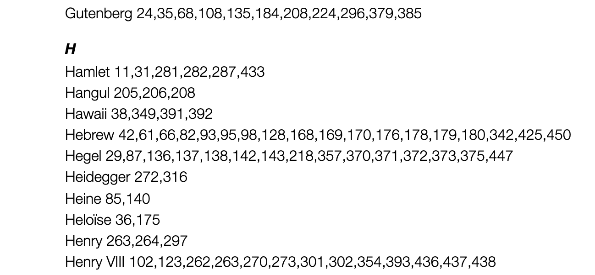
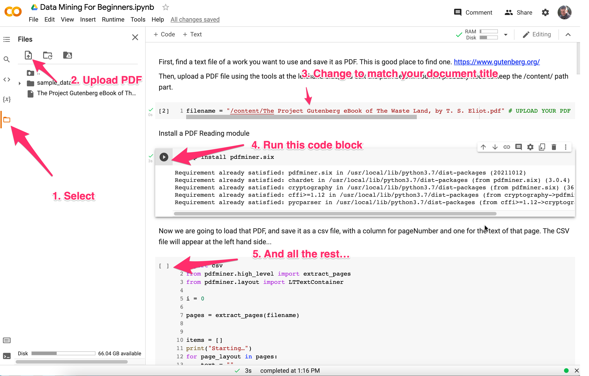

title: Creating an A-Z Index for an Academic Book Using State-of-the-art Natural Language Processing in Python
---

or <i>Data Mining For Beginners</i>

[Brian Cummings](https://www.york.ac.uk/english/our-staff/briancummings/), having completed his book, Bibliophobia, was looking for tools to help in the process of creating an A-Z index.

Brian had found a number of tools including: 

* [TextTract](https://www.texyz.com/textract/?gclid=CjwKCAjwhaaKBhBcEiwA8acsHOrYreYyNSSkpmnJDRX_P93Rqv1l86wUeY541GwiwIqDUssIa6f6ShoCdRUQAvD_BwE)
* [Index-Manager](https://index-manager.net/en/prices/?v=79cba1185463)
* [Cindex](https://www.indexres.com/cindex-features)

But all of these tools had certain limitations, or didn't work on a Mac, and also have not insignificant costs. So we set about looking to see if we could replicate some of the functionality of these tools with some Python code. Python is good programming language to use because there are lots of Natural Language Processing (NLP) libraries available for processing text, but more importantly, there are libraries that do **Named Entity Extraction**, such as [Flair](https://github.com/flairNLP/flair). 

### Named Entity Extraction

There are [A.I or ML tools](https://pahulpreet86.github.io/name-entity-recognition-pre-trained-models-review/) that can do this sort of thing, find "concepts" and "things" in data, but they can require a lot of technical skill to work with. The Flair module is a lot simpler to work with.

With the Flair module added to your python project, you can give it a chunk of text, and Flair will return a list of things, it has found in that text, such as names of people, places, dates, companies, geo political entities, organisations etc. In short, the sort of thing you would usually put in an A-Z index.

The things Flair can find are:

* PERSON People, including fictional
* NORP Nationalities or religious or political groups
* FAC Facilities, buildings, airports, highways, bridges, etc.
* ORGANIZATION Companies, agencies, institutions, etc.
* GPE Countries, cities, states
* LOCATION Non-GPE locations, mountain ranges, bodies of water
* PRODUCT Vehicles, weapons, foods, etc. (Not services)
* EVENT Named hurricanes, battles, wars, sports events, etc.
* WORK OF ART Titles of books, songs, etc.
* LAW Named documents made into laws 
* LANGUAGE Any named language
* DATE Absolute or relative dates or periods
* TIME Times smaller than a day
* MONEY Monetary values, including unit

### The First Problem: Pages

The first problem was that it is quite difficult when reading a Word file where the pages are, in that it depends onto what page size you are printing. So we avoided that headache by saving the book as a 600 page PDF, and used a python module called pdfminer, to get the page data out of the book. 

### The Second Problem: Installation

Working with, and installing extra code modules can be pain, especially so in python, so we used Google Colab notebooks, which are effectively "computers in the cloud" on which we can install modules, upload files and run code.

Here is the Colab notebook we made called [Data Mining For Beginners](https://colab.research.google.com/drive/1M12Wvceq2AdiQ7q8NpxP6W3Hn_AphViU#scrollTo=hOyN7GKOzOdW). You can use it to generate your own list of Entities found in a spreadsheet.

 #### *A Note About Notebooks*

*Colab Notebooks are cool because all the worring or difficult aspects (installing modules and making sure there aren't conflicts with what your system already has etc) are avoided.  The only downside is that the data generated in them is kind of temporary, which means that each time you use the notebook, you have to reinstall all your modules. But, trust me, this is much, much better than trying to install large and complicated modules on your local machine, especially for code that you only want to try out.*

## How To Use The Notebook

If you would like to get a lot of Named Entities out of a text file... 

### Find or generate a PDF file

1. You can find a PDF file on [Project Gutenberg](https://www.gutenberg.org/) or save a Word/Google Document as PDF or on your desktop Print to PDF. *Ideally, before turning any document into a PDF we might remove or clean out any text, such as the Preface, front matter, "Project Gutenberg" info, or appendices etc so that it doesn't taint our data. If we don't do this, we can of course easily remove any entities such as Project Gutenberg from the data gathered.*

2. Open the [Colab notebook](https://colab.research.google.com/drive/1M12Wvceq2AdiQ7q8NpxP6W3Hn_AphViU?usp=sharing), and using the tools at the left-handside, upload your document and change the filename to match as shown below.

   

3. Now, you need to go through each code block and just run it. Some of these take a little while, but it's definitely worth it.
4. Once you have run all your code blocks, a Google Sheet will have been created that contains all the entities found in your document. From there it is easy to make Pivot tables that filter the different entity types

# Creating The A-Z Index Document

Now you have your entity data in a Google Sheet, it is time to change its structure to match a book's A-Z index.  In your sheet use the menu **Tools > Script Editor** and paste the code listed below.

Note: You may need to rename your sheet "Entities" for this to work.

This code generates a Google Document called "Index" that contains your A-Z Index. From there, there is the hard work of making a well crafted index, like Brian did (all 60+ pages of it - first draft).

## Apps Script Code

The code is more easily available [here](apps_script_AZ.js).

`function test_MakeDocument(){`

​      `makeDocument()` 

`}`

`function makeDocument() {`

​    `let ss = SpreadsheetApp.getActiveSpreadsheet()`

​    `let sheet = ss.getSheetByName("Entities")//Change your sheet to this name, or match yours`

​    `let values = sheet.getDataRange().getValues()`

​    `let headers = values.shift()//pop the first row off`

​    `let data = {}`

​    `let words = []`

​    `values.forEach( function(row){`

​      `//Value Type  Confidence  Page  One`                                         

​      `let value = row[0] // the first column's data` 

​      `let type = row[1] // the second column's data`

​      `let confidence = row[2]`

​      `let pageNum = row[3]`

​      `if (value in data){`

​          `data[value].count +=1`

​          `data[value].pages.push(pageNum)`

​      `}else{`

​        `data[value] = {count:1, pages:[pageNum]}`

​        `words.push( value )`

​      `}`

​    `})`

``  

  `let doc = DocumentApp.create("Index")`

  `let body = doc.getBody()`

  `let countAbove = 3`

  `let previousFirstLetter`

  `words.sort()`

  `for (w in words){`

​    `let word = words[w]`

​    `let wordObj = data[word]`

​    `let firstLetter = word.charAt(0)`

​    `if (firstLetter != previousFirstLetter){`

​      `body.appendParagraph(firstLetter).setHeading(DocumentApp.ParagraphHeading.HEADING3)`

​    `}`

​    `if (wordObj.count > countAbove){`

​      `let pages = wordObj.pages`

​      `var unique_pages = pages.filter(onlyUnique);`

​      `body.appendParagraph( word + " " + unique_pages )`

​    `}`

​    `previousFirstLetter = firstLetter`

  `}`

  `doc.saveAndClose()`

  `Logger.log( doc.getUrl() )`

`` 

`}`

`function onlyUnique(value, index, self) {`

  `return self.indexOf(value) === index;`

`}`

# Conclusion

I had no idea that so much work went into the making of an index. In the end Brian used a combination of the data Flair had generated and some of paid-for tools (on trial mode), which had differing features. But, he was more than happy with the leg-up our code had provided, saving him at least two weeks work.

----

Note: It is entirely possible to build upon the Flair datasets, and add more specialist knowledge, for example, here is, [HunFlair](https://github.com/flairNLP/flair/blob/master/resources/docs/HUNFLAIR.md), a version of Flair that has been adapted for recognising entities in  biomedical texts.

Note: In the past I have used the OpenCalais API from Thomson Reuters, but this has a limit on the number of texts (or pages) you can analyse per day.

